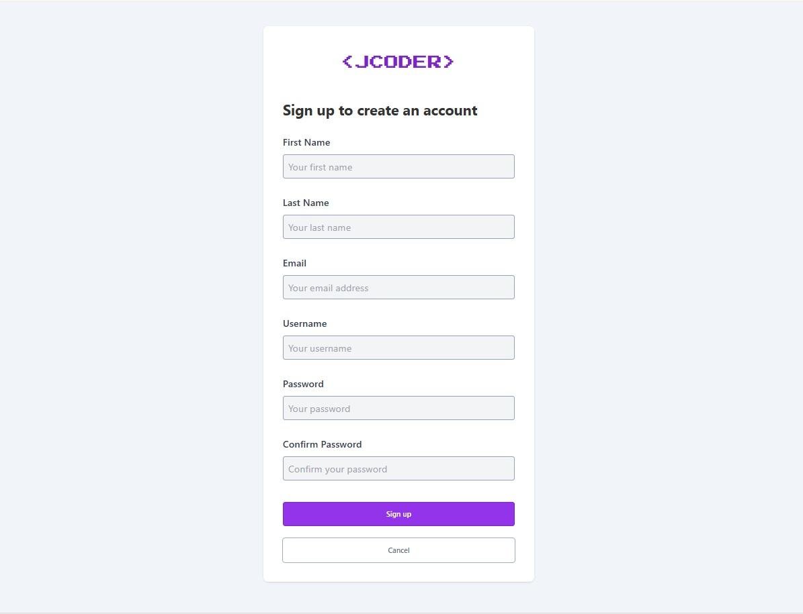
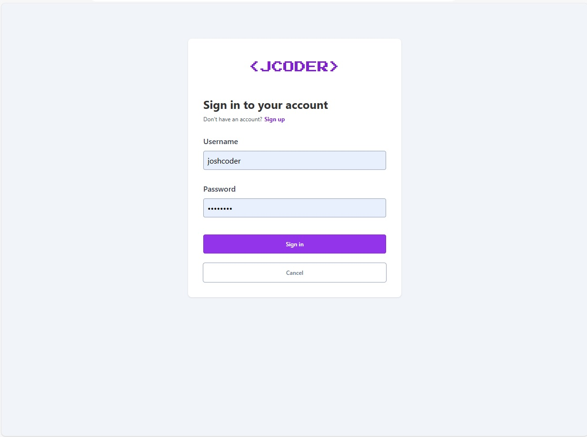

# Blog API Admin Page

This repository contains the [admin page](https://blog-api-admin-page.vercel.app/) for the JCODER blog, built using **React**, **TypeScript**, and **Vite**.

## Features

- **User Authentication**: Sign up and log in pages with secure authentication.
<div style="display: flex;">
  
  <div style="height: 50px"></div>
  
</div>

- **Content Management**: Create, update, and delete blog posts.
- **Dark Mode**: Automatic dark mode styles for a better user experience.
- **Responsive Design**: Optimized for various screen sizes.

## Getting Started

### Prerequisites

- Node.js
- npm or yarn

### Installation

1. Clone the repository:
   ```bash
   git clone https://github.com/JosueDeLosSantos/blog-api-admin-page.git
   ```
2. Navigate to the project directory:
   ```bash
   cd blog-api-admin-page
   ```
3. Install dependencies:
   ```bash
   npm install
   ```

### Running the Application

1. Start the development server:
   ```bash
   npm run dev
   ```
2. Open your browser and navigate to `http://localhost:5173`.

## Deployment

This project is configured for deployment on Vercel. To deploy, follow these steps:

1. Install Vercel CLI:
   ```bash
   npm install -g vercel
   ```
2. Deploy the application:
   ```bash
   vercel
   ```

## Contributing

Contributions are welcome! Please fork the repository and create a pull request with your changes.
